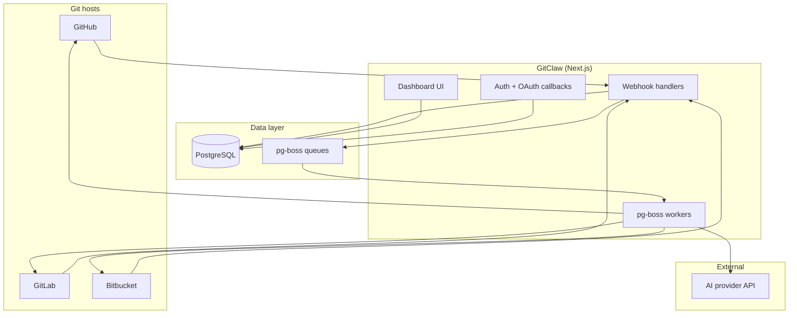

# GitClaw — Product Requirements Document

**Version:** 1.0  
**Last updated:** June 2026  
**Status:** Living document (reflects shipped product)  
**License:** MIT — open source, self-hosted

---

## 1. Executive summary

GitClaw is an open-source, self-hosted AI pull request reviewer for **GitHub**, **GitLab**, and **Bitbucket**. Teams connect their git host from a web dashboard; when a pull request is opened or updated, GitClaw automatically analyzes the diff and posts structured feedback — inline comments and a summary — covering correctness, security, performance, and maintainability.

Unlike SaaS code-review bots, GitClaw runs on the customer's infrastructure with their choice of AI provider (OpenRouter, Groq, Ollama, or any OpenAI-compatible API). Data stays under team control.

**Positioning:** Self-hosted alternative to tools like CodeRabbit, focused on multi-forge support and operator control.

---

## 2. Problem statement

### Pain points

| Problem | Impact |
| --- | --- |
| Manual PR review does not scale | Bottlenecks merge velocity; senior engineers become review gatekeepers |
| SaaS AI reviewers send code to third-party clouds | Security and compliance teams block adoption |
| Single-forge tools | Teams on GitLab or Bitbucket are underserved |
| Inconsistent review quality | Review depth varies by reviewer fatigue and expertise |
| No audit trail across repos | Hard to track review coverage and recurring issue types |

### Opportunity

Provide automated, consistent, line-level PR feedback that runs on the team's own servers, connects to the forge they already use, and integrates into existing PR workflows without changing developer habits.

---

## 3. Goals and non-goals

### Goals

1. **Automate first-pass PR review** — Every eligible PR gets AI feedback within minutes of open/update.
2. **Multi-forge from day one** — GitHub (App), GitLab (OAuth + webhook), Bitbucket (OAuth + webhook).
3. **Self-hosted by default** — Docker or manual install; no mandatory external SaaS beyond chosen AI API.
4. **Structured, actionable output** — Zod-validated findings with severity, file, line, body, and optional fix suggestion.
5. **Operator control** — Per-repo enable/disable, `.gitclaw.yaml` config, review gating, pluggable models.
6. **Observable operations** — Dashboard, PR list/detail, analytics, Slack notifications.

### Non-goals (current version)

- Replacing human approval or merge authority
- CI/CD pipeline execution or build status checks
- Code auto-fix / auto-commit
- Hosted multi-tenant SaaS offering (self-host only)
- IDE or editor plugins
- Support for forges beyond GitHub, GitLab, and Bitbucket

---

## 4. Target users

### Personas

| Persona | Role | Primary needs |
| --- | --- | --- |
| **Platform engineer** | Installs and operates GitClaw | Docker deploy, env config, webhook URLs, AI keys, uptime |
| **Engineering lead** | Configures team usage | Repo enable/disable, `.gitclaw.yaml`, Slack alerts, analytics |
| **Developer** | Authors and reviews PRs | Inline comments in the forge UI, `@gitclaw` follow-up chat |
| **Security-conscious org** | Approves tooling | Self-hosting, model choice, no mandatory cloud beyond AI endpoint |

---

## 5. User stories

### Onboarding

- As a platform engineer, I can self-host GitClaw with Docker so my team does not depend on an external review SaaS.
- As a user, I can sign in with GitHub OAuth and reach the dashboard.
- As a user, I can connect GitHub (App install), GitLab (OAuth + project webhook), or Bitbucket (OAuth + repo webhook) from **Integrations**.

### Automated review

- As a developer, when I open or update a PR, GitClaw reviews the diff and posts inline comments on relevant lines.
- As a developer, I receive a summary comment with an overall assessment of the change.
- As a developer, on subsequent pushes, GitClaw only reviews the incremental diff since `lastReviewedSha`.
- As a developer, I can put `[skip review]` in the PR title to opt out for that PR.

### Configuration

- As an engineering lead, I can disable review for specific repositories from the dashboard.
- As an engineering lead, I can add `.gitclaw.yaml` to a repo to set ignore paths, tone, custom instructions, and static-analysis toggles.
- As an engineering lead, I can configure a Slack webhook to get notified when a review completes.

### Interaction

- As a developer, I can mention `@gitclaw` in a PR comment to ask follow-up questions about the review.
- As a developer, when I open a PR with an empty description, GitClaw can generate an initial PR body.

### Operations

- As an engineering lead, I can view all reviewed PRs, filter by status/repo, and open PR detail with findings.
- As an engineering lead, I can see analytics charts for review volume and finding severity.
- As a platform engineer, I can re-run a review manually from the dashboard.

---

## 6. Functional requirements

### 6.1 Authentication and access

| ID | Requirement | Priority |
| --- | --- | --- |
| AUTH-1 | Users sign in via GitHub OAuth (Better Auth) | P0 |
| AUTH-2 | Unauthenticated users see the marketing landing page at `/` | P0 |
| AUTH-3 | Authenticated users are redirected from `/` to the dashboard | P0 |
| AUTH-4 | Dashboard routes require a valid session (`proxy.ts`) | P0 |
| AUTH-5 | App boots gracefully when core env vars are missing (setup guidance on sign-in) | P1 |

### 6.2 Git provider integrations

| ID | Requirement | Priority |
| --- | --- | --- |
| INT-1 | **GitHub:** GitHub App install flow; webhook at `/api/github/webhook` | P0 |
| INT-2 | **GitLab:** OAuth callback; per-connection webhook at `/api/gitlab/webhook/[connectionId]` | P0 |
| INT-3 | **Bitbucket:** OAuth callback; per-connection webhook at `/api/bitbucket/webhook/[connectionId]` | P0 |
| INT-4 | Provider adapters abstract diff fetch, comment posting, and install/OAuth flows | P0 |
| INT-5 | Token refresh for OAuth providers (GitLab, Bitbucket) | P0 |
| INT-6 | Self-hosted GitLab via `GITLAB_BASE_URL` | P1 |

### 6.3 Webhook processing

| ID | Requirement | Priority |
| --- | --- | --- |
| WH-1 | Verify webhook signatures / secrets per provider | P0 |
| WH-2 | Upsert `PullRequest` records on PR open, update, and relevant comment events | P0 |
| WH-3 | Enqueue background jobs instead of blocking webhook response | P0 |
| WH-4 | Handle `@gitclaw` mention comments → `pr.chat-received` queue | P1 |

### 6.4 Review gating

Reviews are skipped when any of the following apply:

| Condition | Skip reason |
| --- | --- |
| Repository disabled in dashboard | `repo_disabled` |
| `reviews.enabled: false` in `.gitclaw.yaml` | `reviews_disabled` |
| PR is a draft | `draft` |
| Title contains `[skip review]` | `skip_review_title` |
| Author matches bot patterns (Dependabot, Renovate, `*-bot`, etc.) | `bot_author` |
| `headSha` unchanged since last review | `duplicate_sha` |

### 6.5 AI review engine

| ID | Requirement | Priority |
| --- | --- | --- |
| AI-1 | Fetch PR diff and context via provider adapter | P0 |
| AI-2 | Merge static-analysis findings into the prompt | P1 |
| AI-3 | Generate structured output validated by Zod (`summary` + `findings[]`) | P0 |
| AI-4 | Each finding: `file`, `line`, `severity` (`suggestion` \| `issue`), `body`, optional `suggestion` | P0 |
| AI-5 | Chunk large diffs for models with context limits | P1 |
| AI-6 | Post inline comments and summary to the forge PR | P0 |
| AI-7 | Support providers: OpenRouter, Groq, OpenAI-compatible (incl. Ollama) | P0 |
| AI-8 | Configurable model via `GITCLAW_REVIEW_MODEL` | P1 |

### 6.6 Per-repository configuration (`.gitclaw.yaml`)

| Field | Type | Default | Description |
| --- | --- | --- | --- |
| `reviews.enabled` | boolean | `true` | Master switch for reviews |
| `reviews.incremental` | boolean | `true` | Only review changes since last SHA |
| `reviews.post_summary` | boolean | `true` | Post summary comment |
| `reviews.post_inline` | boolean | `true` | Post line-level comments |
| `ignore` | string[] | `[]` | Glob paths to exclude from review |
| `instructions` | string | — | Custom prompt instructions for the repo |
| `tone` | `concise` \| `detailed` \| `mentoring` | `concise` | Review voice |
| `language_focus` | string[] | — | Optional language hints |
| `static_analysis.*` | booleans | all `true` | Toggle eslint, semgrep, gitleaks, npm_audit |
| `auto_description` | boolean | `true` | Generate PR body when empty on open |

### 6.7 PR chat

| ID | Requirement | Priority |
| --- | --- | --- |
| CHAT-1 | Detect `@gitclaw` mentions in PR comments | P1 |
| CHAT-2 | Generate contextual reply using PR diff and review history | P1 |
| CHAT-3 | Post reply as a comment on the PR | P1 |

### 6.8 Auto description

| ID | Requirement | Priority |
| --- | --- | --- |
| DESC-1 | On PR open with empty body, enqueue `pr.auto-description` job | P2 |
| DESC-2 | Respect `auto_description: false` in `.gitclaw.yaml` | P2 |

### 6.9 Dashboard

| Route | Purpose |
| --- | --- |
| `/dashboard` | Overview |
| `/dashboard/repos` | Repository list; per-repo enable toggle |
| `/dashboard/pull-request` | PR list with status/repo filters |
| `/dashboard/pull-request/[id]` | PR detail: findings, markdown summary, severity badges |
| `/dashboard/analytics` | Review volume and severity charts |
| `/dashboard/integrations` | Connect GitHub / GitLab / Bitbucket |
| `/dashboard/settings` | Organization settings, Slack webhook |

### 6.10 Teams and notifications

| ID | Requirement | Priority |
| --- | --- | --- |
| ORG-1 | Organizations with members and roles | P1 |
| ORG-2 | Provider connections scoped to organization | P0 |
| ORG-3 | Slack webhook URL on organization; notify on review complete | P2 |

### 6.11 Background jobs

| Queue | Trigger | Worker action |
| --- | --- | --- |
| `pr.received` | PR open/update passed gating | Run full AI review |
| `pr.chat-received` | `@gitclaw` comment | Generate and post chat reply |
| `pr.auto-description` | PR open, empty body | Generate PR description |

- Backed by **pg-boss** (Postgres); retries: 3 attempts, exponential backoff.
- Workers start with the Next.js server via `instrumentation.ts` (no separate process).

### 6.12 Marketing site

| ID | Requirement | Priority |
| --- | --- | --- |
| MKT-1 | Public landing page at `/` for unauthenticated visitors | P1 |
| MKT-2 | Product features, Docker quick start, optional desktop download cards | P1 |
| MKT-3 | SEO metadata, Open Graph, JSON-LD, `robots.ts`, `sitemap.ts` | P2 |

---

## 7. System architecture

### Tech stack

| Layer | Technology |
| --- | --- |
| Framework | Next.js 16 (App Router), React 19, TypeScript |
| Auth | Better Auth (GitHub OAuth) |
| Database | PostgreSQL, Prisma 7 |
| Git hosts | Octokit + provider adapters |
| AI | Vercel AI SDK |
| Jobs | pg-boss |
| UI | Tailwind CSS v4, shadcn/ui, Phosphor icons |

### Data model (core entities)

- **User** — authenticated account
- **Organization** — workspace; optional Slack webhook
- **OrganizationMember** — user ↔ org membership with role
- **ProviderConnection** — OAuth/App connection per org per forge
- **Repository** — tracked repo; `enabled` flag; cached `.gitclaw.yaml`
- **PullRequest** — PR state, findings JSON, `lastReviewedSha`, status, skip reason

---

## 8. Key user flows

### 8.1 First-time setup

1. Operator clones repo, configures `.env`, runs `docker compose up --build`.
2. User visits app URL → landing page → **Sign in to dashboard**.
3. User goes to **Integrations** → connects forge(s).
4. For GitLab/Bitbucket: copies webhook URL into project/repo settings.
5. For GitHub: installs GitHub App on selected repositories.
6. Opens a test PR → webhook fires → review appears on PR within minutes.

### 8.2 Automatic review

1. Developer opens or pushes to a PR.
2. Forge sends webhook → handler verifies, upserts `PullRequest`, applies gating.
3. If not skipped: job enqueued to `pr.received`.
4. Worker fetches diff, runs static analysis, calls AI, validates output.
5. Worker posts inline comments + summary; updates DB (`status`, `lastReviewedSha`, `reviewFindings`).
6. Optional: Slack notification sent to org webhook.

### 8.3 PR chat

1. Developer comments `@gitclaw why is this pattern risky?` on the PR.
2. Comment webhook → `pr.chat-received` job.
3. Worker loads PR context, generates reply, posts comment.

---

## 9. Success metrics

| Metric | Definition | Target (indicative) |
| --- | --- | --- |
| **Review coverage** | % of eligible PRs that receive a review | > 90% |
| **Time to first comment** | Webhook received → first inline comment posted | < 5 min (p95) |
| **Skip rate** | PRs gated out / total webhook events | Monitor; high rate may indicate misconfiguration |
| **Finding acceptance** | Developer replies or resolves flagged lines | Qualitative; track via forge UI |
| **Re-review accuracy** | Incremental reviews only cover new commits | 100% when `incremental: true` |
| **Operator uptime** | App + workers healthy | 99%+ for self-hosted deployments |

---

## 10. Constraints and dependencies

### Infrastructure

- Node.js 20.9+ or Docker
- PostgreSQL (included in `docker-compose.yml`)
- Public HTTPS URL for webhooks in production (or dev tunnel)

### External services

| Service | Required for |
| --- | --- |
| GitHub OAuth app | User sign-in |
| GitHub App | GitHub PR reviews |
| GitLab OAuth app | GitLab integration (optional) |
| Bitbucket OAuth consumer | Bitbucket integration (optional) |
| AI API (OpenRouter / Groq / Ollama / etc.) | Review generation |

### Security considerations

- Webhook signature verification on all providers
- Tokens stored in database; refresh for OAuth providers
- Self-hosted: operator responsible for network, secrets, and AI data handling
- AI prompts include PR diff content — sent to configured model endpoint only

---

## 11. API surface

| Route | Method | Description |
| --- | --- | --- |
| `/api/auth/[...all]` | * | Better Auth handlers |
| `/api/github/webhook` | POST | GitHub App webhook |
| `/api/github/callback` | GET | GitHub App install callback |
| `/api/gitlab/callback` | GET | GitLab OAuth callback |
| `/api/gitlab/webhook/[connectionId]` | POST | GitLab project webhook |
| `/api/bitbucket/callback` | GET | Bitbucket OAuth callback |
| `/api/bitbucket/webhook/[connectionId]` | POST | Bitbucket repo webhook |
| `/api/dashboard/pull-requests/[id]/status` | * | PR status updates from dashboard |

---

## 12. Future considerations

Not committed; candidate roadmap items:

- Additional forges (Azure DevOps, Gitea)
- Review policies per branch or label
- Custom review templates per team
- SAML / OIDC enterprise auth
- Review approval gates (block merge until GitClaw passes)
- Multi-model routing (fast model for triage, strong model for security)
- Exportable audit reports for compliance
- Helm chart / Kubernetes deployment guide

---

## 13. Open questions

| # | Question | Owner |
| --- | --- | --- |
| 1 | Should desktop installer releases be maintained alongside the web app? | Product |
| 2 | Default organization model: one org per user vs. explicit org creation? | Product |
| 3 | Rate limits and cost controls per org for AI API usage? | Engineering |
| 4 | Which static-analysis tools require external binaries vs. in-process checks? | Engineering |

---

## 14. References

- [README.md](./README.md) — setup and environment variables
- [CONTRIBUTING.md](./CONTRIBUTING.md) — development workflow
- Landing page copy — `features/marketing/`
- Config schema — `features/config/types/gitclaw-config.ts`
- Review gating — `features/reviews/server/review-gate.ts`
