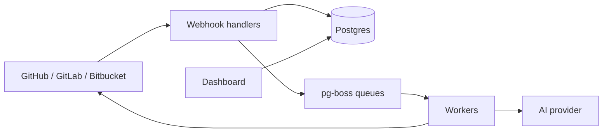

# GitClaw

[](https://github.com/Abhivera/gitclaw/actions/workflows/ci.yml)
[](LICENSE)

Open-source AI pull request reviewer for **GitHub**, **GitLab**, and **Bitbucket**. Connect a provider from the dashboard and every opened or updated PR gets an automated review — summary plus inline comments covering correctness, security, performance, and maintainability. Free to self-host.

## Features

- **Multi-provider** — GitHub App, GitLab OAuth, and Bitbucket OAuth
- **Automatic reviews** — Webhooks on PR open/update; incremental diffs via `lastReviewedSha`
- **Structured AI output** — Vercel AI SDK with Zod-validated findings
- **Pluggable AI** — OpenRouter, Anthropic (Claude), Groq, or any OpenAI-compatible API (OpenAI, Ollama, LM Studio, …)
- **Inline + summary comments** — Posted directly on the pull request
- **Review gating** — Skips drafts, bot authors, duplicate SHAs, and `[skip review]` titles
- **`.gitclaw.yaml`** — Per-repo ignore paths, tone, instructions, and static-analysis toggles
- **PR chat** — Reply to `@gitclaw` mentions in comments
- **Auto description** — Generates a PR body when empty on open
- **Dashboard** — Overview, repos, PR list/detail, analytics, integrations, settings
- **Teams** — Organizations, per-repo enable/disable, Slack notifications on review complete
- **Background jobs** — Postgres-backed queue (pg-boss); no extra orchestrator required

## How it works



1. A provider sends a webhook (PR event or `@gitclaw` comment).
2. `features/git-providers/server/webhook-handler.ts` verifies the payload, applies gating, and upserts a `PullRequest` row.
3. pg-boss runs background work: `pr.received` → review, `pr.chat-received` → chat, `pr.auto-description` → description.
4. The provider adapter fetches diffs; static analysis and repo context are merged into the AI prompt.
5. Findings are posted as inline comments and/or a summary; status is stored in Postgres.

## Tech stack

| Layer | Technology |
| --- | --- |
| Framework | Next.js 16 (App Router), React 19, TypeScript |
| Database | PostgreSQL, Prisma 7 |
| Git hosts | Octokit + provider adapters |
| AI | Vercel AI SDK (OpenRouter / Anthropic / Groq / OpenAI-compatible) |
| Jobs | pg-boss (Postgres-backed) |
| UI | Tailwind CSS v4, shadcn/ui |

## Prerequisites

- Node.js 20.9+ (manual install) or Docker
- [GitHub App](https://github.com/settings/apps) — repo access and PR comments (required for GitHub reviews)
- An AI backend — OpenRouter key, Anthropic key, Groq key, or a local OpenAI-compatible server (Ollama)
- GitLab and/or Bitbucket OAuth apps — only if using those providers
- A **public webhook URL** for production (or a tunnel like ngrok / cloudflared for local dev)

## Quick start (Docker)

```bash
git clone https://github.com/Abhivera/gitclaw.git
cd gitclaw
cp .env.example .env
docker compose up --build
```

Open [http://localhost:3000](http://localhost:3000) and go to **Dashboard → Integrations**.

The compose stack runs Postgres + the app. Migrations apply automatically on container start.

## Manual install

### 1. Clone and install

```bash
git clone https://github.com/Abhivera/gitclaw.git
cd gitclaw
npm install
```

### 2. Start Postgres

```bash
docker compose up -d postgres
```

Postgres listens on port **5438** (database `gitclaw`).

### 3. Configure environment

```bash
cp .env.example .env
```

Fill in `.env`. See [Environment variables](#environment-variables) below.

### 4. Set up the database

```bash
npm run db:migrate
```

### 5. Run the app

```bash
npm run dev
```

Background workers start automatically with the Next.js server (via `instrumentation.ts`). No separate job process is required.

Open [http://localhost:3000](http://localhost:3000) and go to **Dashboard → Integrations**.

### 6. Connect providers

**GitHub**

1. Create a GitHub App with pull request and contents read permissions.
2. Set the webhook URL to `https://<your-host>/api/github/webhook`.
3. Set `GITHUB_APP_SLUG` in `.env` to your app's slug.
4. In the dashboard, click **Connect GitHub** and install the app on your repos.
5. For local dev, use a tunnel (ngrok, cloudflared, etc.) and set `ALLOWED_DEV_ORIGINS` to your tunnel hostname.

**GitLab**

1. Create a GitLab OAuth application with callback `https://<your-host>/api/gitlab/callback`.
2. Authorize from the dashboard, then add the shown webhook URL to your project (merge request events).

**Bitbucket**

1. Create a Bitbucket OAuth consumer with callback `https://<your-host>/api/bitbucket/callback`.
2. Authorize from the dashboard, then add the shown webhook URL to your repo (pull request events).

## Desktop app (Windows, macOS, Linux)

GitClaw ships as a native desktop app with an embedded PostgreSQL database — no Docker required.

### Download installers

Pre-built installers are published on [GitHub Releases](https://github.com/Abhivera/gitclaw/releases/latest):

| Platform | Format |
| --- | --- |
| Windows | `.exe` (NSIS installer) |
| macOS | `.dmg` (Intel + Apple Silicon) |
| Linux | `.AppImage` or `.deb` |

The landing page also lists the latest downloads when releases are available.

### First launch

1. Install and open GitClaw.
2. Go to **File → Open configuration folder** and edit `.env`.
3. Add your GitHub App and AI provider keys.
4. Restart the app — the dashboard opens automatically.

The desktop app wires `DATABASE_URL` to a local Postgres instance stored in your user data folder.

### Webhooks on desktop

Git providers must reach your machine for PR reviews. Use a tunnel (ngrok, cloudflared, etc.) and set `APP_URL` plus `ALLOWED_DEV_ORIGINS` in the desktop `.env` to your public tunnel URL.

### Build from source

```bash
npm install
npm run desktop:dist        # installers in release/desktop/
npm run desktop:dev         # run unpackaged for development
```

Tag a release (`git tag v0.1.0 && git push origin v0.1.0`) to trigger the [desktop release workflow](.github/workflows/release-desktop.yml) on GitHub Actions.

## Environment variables

Copy `.env.example` and set values as follows.

### Core

| Variable | Required | Description |
| --- | --- | --- |
| `APP_URL` | Yes | Public app URL (e.g. `http://localhost:3000`) |
| `DATABASE_URL` | Yes | Postgres connection string |

### GitHub

| Variable | Required | Description |
| --- | --- | --- |
| `GITHUB_APP_ID` | For GitHub reviews | GitHub App ID |
| `GITHUB_APP_PRIVATE_KEY` | For GitHub reviews | PEM private key (`\n` for newlines in `.env`) |
| `GITHUB_WEBHOOK_SECRET` | For GitHub reviews | Webhook secret from the GitHub App |
| `GITHUB_APP_SLUG` | For GitHub reviews | App slug for the install URL |

### GitLab / Bitbucket (optional)

| Variable | Required | Description |
| --- | --- | --- |
| `GITLAB_CLIENT_ID` | For GitLab | OAuth application ID |
| `GITLAB_CLIENT_SECRET` | For GitLab | OAuth application secret |
| `GITLAB_BASE_URL` | No | Self-hosted GitLab base URL (default: `https://gitlab.com`) |
| `BITBUCKET_CLIENT_ID` | For Bitbucket | OAuth consumer key |
| `BITBUCKET_CLIENT_SECRET` | For Bitbucket | OAuth consumer secret |

### AI (pick one provider)

| Variable | Required | Description |
| --- | --- | --- |
| `AI_PROVIDER` | No | `openrouter` \| `anthropic` \| `groq` \| `openai-compatible` \| `ollama` (auto-detects if unset) |
| `OPENROUTER_API_KEY` | OpenRouter | API key ([openrouter.ai](https://openrouter.ai/)) |
| `ANTHROPIC_API_KEY` | Anthropic | API key ([console.anthropic.com](https://console.anthropic.com/)) |
| `GROQ_API_KEY` | Groq | API key ([console.groq.com](https://console.groq.com/)) |
| `OPENAI_BASE_URL` | OpenAI-compatible | e.g. `http://localhost:11434/v1` for Ollama |
| `OPENAI_API_KEY` | Optional | API key for OpenAI-compatible endpoints that require one |
| `GITCLAW_REVIEW_MODEL` | No | Model id (defaults: `openrouter/free`, `claude-sonnet-4-6`, `llama-3.3-70b-versatile`, `gpt-4o-mini`) |

### Development

| Variable | Required | Description |
| --- | --- | --- |
| `ALLOWED_DEV_ORIGINS` | No | Comma-separated tunnel hostnames for local webhook testing |

## Scripts

| Command | Description |
| --- | --- |
| `npm run dev` | Start Next.js dev server (workers included) |
| `npm run build` | Production build |
| `npm run start` | Start production server |
| `npm run lint` | Run ESLint |
| `npm run typecheck` | Run TypeScript checks |
| `npm run db:push` | Push Prisma schema to the database |
| `npm run db:migrate` | Create and apply migrations |
| `npm run db:studio` | Open Prisma Studio |
| `npm run desktop:dev` | Build and run the desktop app (dev) |
| `npm run desktop:dist` | Package installers for Windows, macOS, and Linux |

## Project structure

```
app/                         # Next.js routes (pages, API handlers)
features/
  git-providers/             # Adapters, connections, webhooks, GitHub install
  jobs/                      # pg-boss queue + workers
  reviews/                   # AI review, chat, auto-description
  static-analysis/           # Pattern-based diff checks
  config/                    # .gitclaw.yaml parse and apply
  dashboard/                 # Shell, nav, queries
  analytics/                 # Dashboard charts
  organizations/             # Workspaces
  notifications/             # Slack webhooks
  ai/                        # AI provider factory
lib/                         # Prisma client, env, instance bootstrap
prisma/                      # Schema and migrations
```

## API routes

| Route | Method | Description |
| --- | --- | --- |
| `/api/github/webhook` | POST | GitHub App webhook |
| `/api/github/callback` | GET | GitHub App install callback |
| `/api/gitlab/callback` | GET | GitLab OAuth callback |
| `/api/gitlab/webhook/[connectionId]` | POST | GitLab project webhook |
| `/api/bitbucket/callback` | GET | Bitbucket OAuth callback |
| `/api/bitbucket/webhook/[connectionId]` | POST | Bitbucket repo webhook |

## Contributing

Contributions are welcome. See [CONTRIBUTING.md](./CONTRIBUTING.md) for setup and pull request guidelines.

## License

[MIT License](./LICENSE) — free to use, modify, and self-host.
