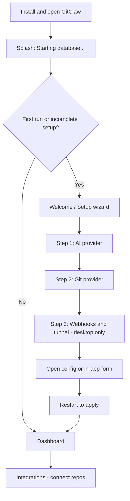

# Desktop setup UX plan

Plan for guiding cross-platform desktop users (Windows, macOS, Linux) through configuration when they install GitClaw — without expecting them to discover a hidden `.env` file or read the README first.

## Current state

On desktop, `desktop/server.mjs` injects `APP_URL` and `DATABASE_URL` at runtime. Core env validation therefore always passes:

- Users **never see** the web `SetupRequired` screen
- They land on an **empty dashboard** with no onboarding
- Integrations show developer-oriented hints (e.g. “Set `GITHUB_APP_SLUG` in `.env`”)
- Configuration lives in a user-data folder, opened only via **File → Open configuration folder**
- Changes require a **full app restart** — easy to miss

This works for developers but is confusing for a packaged installer experience.

### Config file location

| Platform | Path |
| --- | --- |
| Windows | `%APPDATA%\gitclaw-desktop\config\.env` |
| macOS | `~/Library/Application Support/gitclaw-desktop/config/.env` |
| Linux | `~/.config/gitclaw-desktop/config/.env` (or XDG equivalent) |

`DATABASE_URL` and local `APP_URL` are managed by the app and should not be shown to end users.

---

## Goals

| Goal | Why |
| --- | --- |
| Guided first run | User knows what to do in the first 60 seconds |
| Hide managed infra | Don’t expose `DATABASE_URL` or local `APP_URL` unless needed for webhooks |
| Progress, not errors | Checklist of what’s left instead of raw validation messages |
| One obvious action | “Open configuration” — not buried in the menu |
| Explicit restart | Clear “Save → Restart to apply” flow |
| Webhook help | Desktop’s hardest step needs its own guided section |

---

## Target user journey



---

## Phase 1 — Desktop onboarding screen

**Highest impact, smallest scope.** Ship this first.

### What to build

1. **`DesktopSetup` screen** (full-screen gate before dashboard shell)
   - Shown when `GITCLAW_DESKTOP=1` and setup is incomplete
   - **Complete** when at least one AI backend and one git provider are configured

2. **Checklist UI** — three sections:

   | Section | User sees | Done when |
   | --- | --- | --- |
   | **AI** | Pick OpenRouter / Groq / Ollama; link to get a key | `OPENROUTER_API_KEY`, `GROQ_API_KEY`, or `OPENAI_BASE_URL` is set |
   | **Git provider** | GitHub (recommended) / GitLab / Bitbucket | `GITHUB_APP_SLUG` (+ related keys) or OAuth client IDs set |
   | **Webhooks** (desktop) | “Git hosts must reach your machine” + tunnel steps | `ALLOWED_DEV_ORIGINS` set (optional until connecting a provider) |

3. **Primary CTAs on every section**
   - **Open configuration file** — opens `.env` in the default editor
   - **Open configuration folder** — opens the folder in Finder / Explorer / file manager
   - Not only under the File menu

4. **Electron bridge** (`desktop/preload.mjs` + `desktop/main.mjs`)

   ```ts
   gitclawDesktop.openConfigFolder()
   gitclawDesktop.openEnvFile()
   gitclawDesktop.restartApp()
   gitclawDesktop.configPath  // display path for power users
   ```

5. **Copy updates for desktop**
   - From: “Set `GITHUB_APP_SLUG` in `.env`”
   - To: “Add your GitHub App details — Open configuration file”

6. **Splash during startup**
   - While embedded Postgres initializes, show “Starting GitClaw…” instead of a blank window

### Routing

- Desktop: load `/dashboard/setup` first when incomplete; otherwise `/dashboard`
- Web self-host: keep current behavior (landing page or `SetupRequired` for missing core env)

### New code (suggested)

| Piece | Location |
| --- | --- |
| `getDesktopSetupStatus()` | `lib/env.ts` or `features/setup/lib/desktop-setup.ts` |
| `DesktopSetup` component | `features/setup/components/desktop-setup.tsx` |
| Layout gate | `app/dashboard/layout.tsx` |
| Desktop hint copy | `features/git-providers/lib/provider-config.ts`, `ProviderConnectCard` |
| IPC handlers | `desktop/main.mjs`, `desktop/preload.mjs` |

---

## Phase 2 — In-app settings form

Avoid raw `.env` editing for most users.

1. **`/dashboard/settings/configuration`** (desktop only)
   - Form fields grouped like `.env.example`: GitHub, GitLab, Bitbucket, AI
   - Secrets as password inputs; never echo back in API responses
   - **Save** writes `config/.env` via desktop-only API or Electron IPC
   - **Validate** on save (reuse `lib/env.ts` schemas)
   - Prompt: “Restart GitClaw to apply changes” with a **Restart** button

2. **Keep `.env` as source of truth**
   - Form reads and writes the same file `desktop/env.mjs` manages
   - Power users can still edit the file manually

3. **Advanced section** (collapsed)
   - `ALLOWED_DEV_ORIGINS`, `GITCLAW_REVIEW_MODEL`, `AI_PROVIDER`
   - Link to README [Environment variables](../README.md#environment-variables)

---

## Phase 3 — Webhook and tunnel assistant

Desktop users often get stuck here: git hosts must reach the machine running GitClaw.

1. **Dedicated “Webhooks” step** in onboarding
   - Explain: “Your PC runs GitClaw locally; GitHub/GitLab need a public URL to send events.”
   - Steps: install ngrok or cloudflared → run tunnel → set `ALLOWED_DEV_ORIGINS` to the tunnel hostname
   - Show current `APP_URL` and whether a tunnel appears configured

2. **Integrations page**
   - If desktop and `ALLOWED_DEV_ORIGINS` is unset: banner above connect cards
   - Copy-ready webhook URL when tunnel base is configured

3. **Later (optional)**
   - Bundled cloudflared helper or “test webhook” ping

---

## Phase 4 — Polish and cross-platform consistency

| Item | Detail |
| --- | --- |
| **Menu** | Add Settings, Restart, Open configuration (not only under File) |
| **Tray icon** (Win / Linux) | Quick access to config and restart |
| **macOS** | Config path under GitClaw → Settings… |
| **First-run flag** | `firstRunComplete` in userData; show welcome once |
| **Env hot-reload** (optional) | Watch `.env` and restart Next child process without quitting Electron |
| **Error dialog** | Map startup failures to “Open configuration folder” action |

---

## Variables: hide vs show on desktop

| Variable | Desktop UX |
| --- | --- |
| `DATABASE_URL` | Hidden — managed by app |
| `APP_URL` | Hidden by default; show in webhook step when tunnel is needed |
| `GITHUB_*`, `GITLAB_*`, `BITBUCKET_*` | Setup wizard + settings form |
| `OPENROUTER_API_KEY` / `GROQ_*` / `OPENAI_*` | Setup wizard + settings form |
| `ALLOWED_DEV_ORIGINS` | Webhook step only |
| `AI_PROVIDER`, `GITCLAW_REVIEW_MODEL` | Advanced settings |

---

## Implementation order

1. Electron IPC — open config folder/file, restart app
2. `getDesktopSetupStatus()` — missing AI / provider / tunnel items
3. `DesktopSetup` component — checklist + CTAs
4. Dashboard layout gate — redirect incomplete desktop users to setup
5. Update `ProviderConnectCard` and setup hints for desktop
6. Splash screen during Postgres boot
7. Settings form (Phase 2)
8. Webhook assistant (Phase 3)

---

## Success criteria

- First-time user reaches **Integrations with at least one provider configured** without reading the README
- No “where is `.env`?” support questions
- Restart-after-save is obvious and one-click

---

## Related docs

- [README — Desktop app](../README.md#desktop-app-windows-macos-linux)
- [README — Environment variables](../README.md#environment-variables)
- [PRD](../PRD.md)
